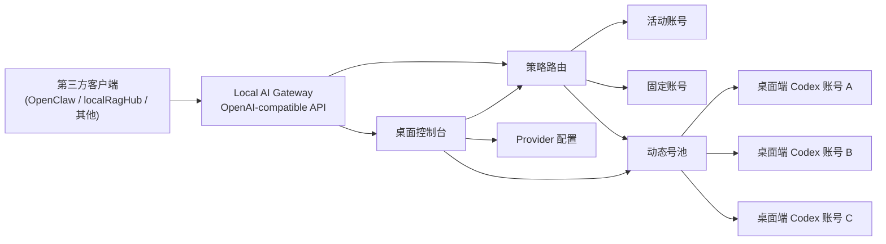

# Local AI Gateway


一个面向 macOS 本地单机环境的 AI 网关项目。  
它的核心目标很简单：

**把本机可用的 AI 账号能力整理成稳定的本地 Provider，让 OpenClaw、localRagHub 等第三方客户端通过统一 `baseUrl` 接入。**

当前主线仍然是 `Codex`，并已具备：

- 本地 `127.0.0.1` 网关服务
- OpenAI-compatible 接口
- Electron 桌面控制台
- 多账号管理与活动账号切换
- 策略路由
- 动态号池（进行中）

## 目录

- [项目定位](#项目定位)
- [当前已实现能力](#当前已实现能力)
- [适用场景](#适用场景)
- [非目标与边界](#非目标与边界)
- [架构概览](#架构概览)
- [快速开始](#快速开始)
- [第三方接入](#第三方接入)
- [常用命令](#常用命令)
- [项目结构](#项目结构)
- [开发阶段](#开发阶段)
- [文档入口](#文档入口)

## 项目定位

`Local AI Gateway` 不是公网服务，也不是 SaaS 平台。  
它是一个：

- 本地单用户
- 本地长期运行
- 以桌面端控制为主
- 以本地网关转发为核心

的 AI 网关 / 账号管理 / 请求调度工具。

当前最成熟、最完整的链路是：

`桌面端导入 Codex 账号 -> 本地网关暴露 OpenAI-compatible 接口 -> 第三方客户端接入 -> 账号活动 / 路由 / 号池调度观测`

## 当前已实现能力

### 1. 本地网关

- 本地监听 `127.0.0.1`
- 默认入口：`http://127.0.0.1:8787/v1`
- 支持：
  - `GET /v1/models`
  - `POST /v1/chat/completions`
  - 流式响应
  - 工具调用
- 提供 Admin API 与桌面端控制台

### 2. Codex 账号管理

- 浏览器 OAuth 导入
- 本地 JSON / `auth-profiles.json` 导入
- Cockpit Tools 多平台导出文件中的 Codex 账号导入
- 当前活动账号切换
- 账号置顶、刷新、删除
- 实时额度快照、来源分布、请求数、最近调用

### 3. 请求调度与观测

- 默认模型路由
- 策略路由
  - 按 `clientTag`
  - 按请求模型别名
- 路由预演
- 路由命中观测
- 统计持久化
- 第三方接入鉴权

### 4. 动态号池（三期进行中）

- 独立“号池调度”模块
- 可视多选池成员
- 额度阈值
- 冷却
- 有限重试
- 请求级自动切号
- 号池运行时观测
- 最近调度事件解释

### 5. 扩展 Provider

当前除 `Codex` 外，还预留并支持基础配置：

- `OpenAI-compatible`
- `Ollama`

这两类能力当前保留，但在产品主路径中被有意弱化。  
本项目目前的主要价值仍然是 **Codex 本地网关化**。

## 适用场景

当前最适合的场景：

- 想把本机 Codex 账号能力接到 OpenClaw
- 想把本机 Codex 账号能力接到 localRagHub
- 想统一多个桌面端 Codex 账号，并在本地完成手动切号或动态号池调度
- 想通过一个稳定的本地 `baseUrl`，减少第三方客户端中重复改模型配置的成本

## 非目标与边界

以下内容当前明确 **不做** 或 **长期不做**：

- 不做公网暴露
- 不做多设备同步
- 不做多人协作权限系统
- 不做云端控制台
- 不做真正的多账号额度池化或额度合并结算
- 不直接把原始本地可复用授权当作正式号池成员
- 不通过修改全局 `activeSessionId` 实现自动轮换
- 不做流式输出中途的无感热切换

## 架构概览



## 快速开始

### 1. 安装依赖

```bash
npm install
```

### 2. 启动桌面端

```bash
npm run dev:desktop
```

### 3. 在桌面端完成最小配置

推荐最小路径：

1. 导入一个或多个 Codex 账号
2. 选中当前活动账号
3. 保持默认模型 `codex-default`
4. 复制第三方接入模板
5. 在第三方客户端填入 `baseUrl + model`

## 第三方接入

本地服务启动后，第三方客户端通常填写：

```txt
Base URL: http://127.0.0.1:8787/v1
Model: codex-default
```

如果开启了网关 API Key 鉴权，还需填写：

```txt
API Key: 你在桌面端“诊断”页保存的网关访问密钥
```

当前桌面端已内置三套可复制模板：

- OpenClaw
- localRagHub
- 通用 cURL

## 常用命令

```bash
npm install
npm run build
npm run test
npm run dev:gateway
npm run dev:desktop
npm run smoke:gateway
npm run smoke:desktop-package
npm run preflight:release
npm run package:desktop
npm run dist:desktop
```

## 项目结构

```txt
apps/
  gateway/                 Fastify 网关服务与 Admin API
  desktop/                 Electron 桌面控制台
packages/
  core/                    配置、日志、SQLite、本地路径
  openclaw-session/        本地可复用授权发现与桌面端 Codex 账号存储
  provider-codex/          Codex Provider 适配层
  openai-compat/           OpenAI-compatible 协议转换
  shared/                  共享类型、常量、错误模型
docs/
  prd/                     产品需求文档
  architecture/            架构与设计方案
  operations/              运行、调试、维护文档
```

## 开发阶段

### 一期

- 本地网关 MVP
- Codex Provider
- 桌面端账号管理
- 第三方基础接入

状态：**已完成**

### 二期

- 策略路由
- 路由观测
- 统计持久化
- 接入鉴权
- 多上游模型暴露

状态：**已完成并验收**

### 三期

- 动态号池
- 请求级自动切号
- 号池运行时观测
- 更细的成员级解释与消耗归因

状态：**进行中**

## 文档入口

### 核心文档

- [文档总览](./docs/README.md)
- [v1 产品需求文档（PRD）](./docs/prd/local-ai-gateway-v1.md)
- [架构总览](./docs/architecture/overview.md)
- [概念地图](./docs/architecture/%E6%A6%82%E5%BF%B5%E5%9C%B0%E5%9B%BE.md)
- [动态号池设计方案](./docs/architecture/%E5%8A%A8%E6%80%81%E5%8F%B7%E6%B1%A0%E8%AE%BE%E8%AE%A1%E6%96%B9%E6%A1%88.md)

### 运行与维护

- [桌面控制台使用说明](./docs/operations/%E6%A1%8C%E9%9D%A2%E6%8E%A7%E5%88%B6%E5%8F%B0%E4%BD%BF%E7%94%A8%E8%AF%B4%E6%98%8E.md)
- [第三方客户端接入模板与错误排查](./docs/operations/%E7%AC%AC%E4%B8%89%E6%96%B9%E5%AE%A2%E6%88%B7%E7%AB%AF%E6%8E%A5%E5%85%A5%E6%A8%A1%E6%9D%BF%E4%B8%8E%E9%94%99%E8%AF%AF%E6%8E%92%E6%9F%A5.md)
- [OpenClaw 接入与运行说明](./docs/operations/openclaw-%E6%8E%A5%E5%85%A5%E4%B8%8E%E8%BF%90%E8%A1%8C.md)
- [OpenClaw 联调验收清单](./docs/operations/openclaw-%E8%81%94%E8%B0%83%E9%AA%8C%E6%94%B6%E6%B8%85%E5%8D%95.md)
- [Provider 扩展配置](./docs/operations/provider-%E6%89%A9%E5%B1%95%E9%85%8D%E7%BD%AE.md)
- [安装与升级检查清单](./docs/operations/%E5%AE%89%E8%A3%85%E4%B8%8E%E5%8D%87%E7%BA%A7%E6%A3%80%E6%9F%A5%E6%B8%85%E5%8D%95.md)
- [Codex 接入风险与限流说明](./docs/operations/codex-%E6%8E%A5%E5%85%A5%E9%A3%8E%E9%99%A9%E4%B8%8E%E9%99%90%E6%B5%81%E8%AF%B4%E6%98%8E.md)
- [开发与变更流程](./docs/operations/%E5%BC%80%E5%8F%91%E4%B8%8E%E5%8F%98%E6%9B%B4%E6%B5%81%E7%A8%8B.md)
- [打包与发布说明](./docs/operations/%E6%89%93%E5%8C%85%E4%B8%8E%E5%8F%91%E5%B8%83.md)

### 长期维护

- [项目答疑与开发清单](./docs/operations/%E9%A1%B9%E7%9B%AE%E7%AD%94%E7%96%91%E4%B8%8E%E5%BC%80%E5%8F%91%E6%B8%85%E5%8D%95.md)
- [架构决策记录（ADR）](./docs/decisions/0001-%E6%9C%8D%E5%8A%A1%E4%BC%98%E5%85%88%E4%BA%8E%E6%A1%8C%E9%9D%A2%E5%A3%B3.md)
- [变更记录](./CHANGELOG.md)
