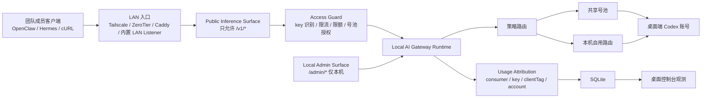

# 局域网小范围共享中转站技术实施方案

> 2026.05.12

本文档记录将 `Local AI Gateway` 从“本机自用中转网关”扩展为“局域网内 1-2 人小范围共享中转站”的技术实施方案。

本方案以“公网可演进内核”为设计原则：第一阶段只服务可信小团队，但在访问者身份、密钥、限额、号池授权、管理面隔离和用量归因上预留公网共享中转站所需的基础抽象，避免后续从 LAN 方案演进到半公网 / 公网方案时大面积返工。

本文是技术规划文档，不代表已经进入实现阶段。

## 1. 结论摘要

局域网小范围共享具备较高可行性，且可以作为公网共享中转站的前置演进层。

当前项目已经具备以下基础：

- OpenAI-compatible `/v1/models` 与 `/v1/chat/completions`
- Codex 账号导入、活动账号与动态号池
- 策略路由、`clientTag`、路由命中观测
- Token 用量统计与账号 / 客户端 / 模型排行
- API Key 鉴权与客户端密钥映射
- 账号冷却、失败分类、客户端熔断和 `Retry-After`
- 桌面端控制台和 macOS 常驻能力

LAN 共享的核心改造不是“把端口改成 `0.0.0.0`”，而是增加一个受控的“共享推理面”：

- 外部成员只访问 `/v1/*`
- 管理面 `/admin/*`、账号导入、号池编辑、统计清空和服务重启仍只允许本机
- 每个成员使用独立访问密钥
- 每个成员有独立用量、限流、并发和号池授权策略
- 桌面端能观测“谁在用、用了多少、是否异常、命中了哪个号池和账号”

推荐先做 `LAN MVP`，再逐步补齐公网可演进能力。

自用网关与 LAN 小范围共享不建议拆成两个独立桌面客户端。更合理的近期形态是：同一套本地系统、同一个桌面控制台、同一个本机数据目录，但在产品和架构上明确区分“本机自用主路径”和“共享访问模块”。远期如果进入公网共享站阶段，不应把桌面自用版直接外放，而应基于同一核心包派生独立的 server edition 或部署 profile。

## 2. 目标与非目标

### 2.1 目标

第一阶段目标：

- 允许同一局域网或私有网络内的 1-2 个可信成员访问本机网关推理接口。
- 成员无需拿到本机 Codex 账号凭据，只通过网关 API Key 使用能力。
- 账号仍部署和维护在网关主机，也就是用户自己的 Mac 上。
- 网关主机必须开机且桌面端 / 托管网关保持运行。
- 外部成员请求可按成员归因、限流、观测和暂停。
- 本机 OpenClaw / Hermes 自用链路优先，不被共享成员无边界抢占。
- 自用功能仍保持默认主路径，LAN 共享作为默认关闭的可选模块启用。
- 方案保留向半公网 / 公网共享网关演进的对象模型。

### 2.2 非目标

第一阶段不做：

- 不做公网直接开放。
- 不做公开注册、支付、充值、套餐和余额扣费。
- 不做云端控制台。
- 不做多机器高可用。
- 不做陌生用户服务。
- 不做真正的多账号额度合并结算。
- 不把 Cockpit / OpenClaw 原始配置变成共享账号库存。
- 不允许外部成员访问 Admin API 或账号管理能力。

## 3. 与公网共享方案的关系

现有《公网共享中转站技术可行性分析》讨论的是更高风险、更完整的平台化方向。本文档聚焦它的前置阶段。

两者关系如下：

| 维度 | LAN 小范围共享 | 公网共享中转站 |
| --- | --- | --- |
| 使用者 | 可信小团队，1-2 人 | 半可信或不可信用户 |
| 网络入口 | 局域网、Tailscale、ZeroTier、反向代理 | 域名、HTTPS、反代、WAF、隧道或云部署 |
| 鉴权 | 每成员独立 key | 完整租户 / 用户 / key 生命周期 |
| 限流 | key 级 QPS、并发、日限额 | IP、租户、key、模型、账号池多层限流 |
| 观测 | 成员用量、失败率、命中账号 | 租户审计、成本、异常告警、封禁 |
| 风险 | 本机暴露、额度被打满、明文 LAN | 滥用、撞库、封号、合规、运维 SLA |
| 工程成本 | 中低 | 中高到高 |

### 3.1 自用版与共享版的系统形态

建议采用“同一代码库、同一桌面系统、不同运行模式”的近期方案，而不是立即拆成两个独立客户端。

原因：

- 自用版和 LAN 共享版复用同一批核心能力：账号管理、OpenAI-compatible 协议、策略路由、动态号池、Token 统计、桌面观测和 macOS 常驻。
- LAN 共享的用户规模很小，拆成两个客户端会带来重复打包、重复配置、重复迁移、重复观测和重复测试成本。
- 当前项目的核心价值仍是自用本地网关；共享能力应作为受控扩展，而不是把产品重心整体迁移到多人平台。
- 只要推理面、管理面、号池、限流和观测维度隔离得当，共享流量不会必然降低自用质量。

但同一系统不等于混在一起。实现上应明确四条隔离线：

- `Local Owner Mode`：默认自用模式，继续服务本机 OpenClaw / Hermes，功能不依赖共享模块。
- `Shared Access Module`：默认关闭，仅在用户显式开启 LAN 共享时生效。
- `Private Resources`：自用账号、自用路由、自用号池默认不对共享成员开放。
- `Shared Resources`：共享成员只能使用显式授权的 shared 号池、模型和策略。

不建议的近期方案：

- 为 LAN 小范围共享单独做一个独立 Electron 客户端。
- 把自用版和共享版拆成两个互不共享数据模型的系统。
- 用同一个全局 API Key 和同一个活动账号同时服务本机自用与共享成员。

远期公网共享站的建议形态不同：保留同一 monorepo 和核心包，但新增独立 `shared-server` / `public-gateway` 部署形态。公网版可以复用协议转换、provider、路由、号池、统计和访问控制内核，但不应直接复用桌面自用客户端作为公网服务入口。

如果 LAN 版从一开始只做“共享一个全局 API Key + 端口外放”，后续扩展到公网会返工严重。

如果 LAN 版从一开始引入以下对象：

- `AccessConsumer`
- `AccessKey`
- `AccessPolicy`
- `PoolBinding`
- `UsageAttribution`
- `PublicInferenceSurface`
- `LocalAdminSurface`

则后续可以平滑演进到半公网共享，甚至作为公网共享方案的内核。

## 4. 当前能力与主要差距

### 4.1 已有能力可复用

网关层：

- Fastify 服务已经支持 `host` / `port` 参数。
- 推理接口集中在 `/v1/models` 与 `/v1/chat/completions`。
- Admin API 已通过 `adminToken` 保护。
- 接入鉴权已经覆盖 `/v1/models` 和 `/v1/chat/completions`。
- `resolveClientTagByApiKey` 已可通过 API Key 自动归因来源。

调度层：

- 策略路由支持按 `clientTag` 匹配。
- 动态号池支持固定成员、阈值、冷却、有限重试和运行态观测。
- 请求级选号不会改写全局活动账号。

观测层：

- `inference_usage_events` 已记录请求维度、账号维度、客户端维度和模型维度用量。
- 桌面端已展示 Token 用量总览、账号级排行、来源分布、路由命中和号池事件。

桌面端：

- 已有系统配置页、鉴权配置 UI、客户端密钥映射 UI、端口配置、接入模板和运行诊断。

### 4.2 需要补齐的核心差距

网络与安全：

- 当前默认 `127.0.0.1`，没有明确的 LAN 共享模式。
- `/v1/*` 与 `/admin/*` 在同一个 Fastify app 内，LAN 化后需要管理面本机隔离。
- `/healthz` 当前会返回较完整健康信息，外放时需要收敛。
- 现有 API Key 更偏“客户端映射”，不是完整访问者模型。

访问控制：

- 缺少 key 禁用、轮换、过期、备注、最后使用时间。
- 缺少每 key 并发、QPS、日 / 月 Token 限额。
- 缺少访问者到号池的授权绑定。
- 缺少共享成员与自用客户端之间的优先级隔离。

观测与 UI：

- 当前用量主要按 `clientTag` 统计，没有稳定的 `consumerId / accessKeyId`。
- UI 中没有“团队成员 / 共享访问者”的一等视角。
- 当前接入模板默认面向本机 `127.0.0.1`，缺少 LAN Base URL 和远端成员配置片段。

风控与审计：

- 缺少按访问者记录失败率、限流命中、暂停原因。
- 外部错误响应还需要进一步脱敏，避免泄露内部账号、路径、sessionId 或 OAuth 细节。

## 5. 推荐总体架构

推荐架构是“本机管理面 + 受控共享推理面”。



核心原则：

- 自用能力是默认主路径，共享能力是显式开启的附加模块。
- 推理面可以 LAN 可达。
- 管理面默认只允许 `127.0.0.1` / `::1`。
- 外部成员身份以 `accessKeyId / consumerId` 为准，`clientTag` 继续作为兼容和展示字段。
- 共享路由默认进入共享号池，不直接复用本机自用活动账号。
- 自用请求应具备更高优先级或保留额度，避免共享成员拖垮本机 OpenClaw / Hermes。
- 共享模块故障不应影响本机自用网关启动、账号管理、路由和统计。
- 所有共享成员能力都可暂停和回滚。

## 6. 核心对象模型

### 6.1 `AccessConsumer`

表示一个访问者，可以是团队成员、设备或系统。

建议字段：

```ts
type AccessConsumer = {
  id: string;
  name: string;
  clientTag: string;
  type: "local-owner" | "lan-member" | "system-client";
  enabled: boolean;
  note?: string;
  createdAt: string;
  updatedAt: string;
};
```

说明：

- `local-owner` 用于本机 OpenClaw / Hermes 等自用入口。
- `lan-member` 用于团队成员。
- `system-client` 用于后续自动化服务或外部集成。
- `clientTag` 不再作为唯一身份，只作为路由和展示兼容字段。

### 6.2 `AccessKey`

表示访问密钥。实际存储时不保存明文，只保存 hash 和前后缀提示。

建议字段：

```ts
type AccessKey = {
  id: string;
  consumerId: string;
  name: string;
  keyHash: string;
  keyPrefix: string;
  keySuffix: string;
  enabled: boolean;
  expiresAt?: string;
  lastUsedAt?: string;
  rotatedAt?: string;
  createdAt: string;
  updatedAt: string;
};
```

说明：

- 现有 `GatewayInferenceAuthClientMapping` 可作为过渡数据源。
- 新模型落地后，旧映射可以迁移为 `AccessConsumer + AccessKey`。
- 生成后的 key 只显示一次，后续 UI 只显示前缀 / 后缀和状态。

### 6.3 `AccessPolicy`

表示访问者权限与限制。

建议字段：

```ts
type AccessPolicy = {
  consumerId: string;
  allowedModelAliases?: string[];
  allowedPoolIds?: string[];
  maxConcurrentRequests?: number;
  requestsPerMinute?: number;
  dailyTokenLimit?: number;
  monthlyTokenLimit?: number;
  maxInputTokens?: number;
  maxOutputTokens?: number;
  allowStreaming?: boolean;
  enabled: boolean;
};
```

第一阶段最少实现：

- `maxConcurrentRequests`
- `requestsPerMinute`
- `dailyTokenLimit`
- `allowedPoolIds`

### 6.4 `PoolBinding`

访问者与号池之间的授权关系。

第一阶段可直接放在 `AccessPolicy.allowedPoolIds`。

后续公网演进时可以独立成表：

```ts
type PoolBinding = {
  consumerId: string;
  poolId: string;
  priority?: number;
  enabled: boolean;
};
```

### 6.5 `LanShareSettings`

表示 LAN 共享全局设置。

建议字段：

```ts
type LanShareSettings = {
  enabled: boolean;
  bindHost: "127.0.0.1" | "0.0.0.0" | "lan-only";
  publicBaseUrl?: string;
  allowedCidrs?: string[];
  requireApiKey: true;
  exposeHealthz?: "none" | "minimal";
  adminLoopbackOnly: true;
  recommendedEntry?: "tailscale" | "zerotier" | "reverse-proxy" | "direct-lan";
};
```

第一阶段建议：

- UI 上只提供 `关闭 / 私有网络 / 局域网` 三档。
- 不鼓励用户手填 `0.0.0.0`。
- 直接 LAN 模式必须显示风险提示。

## 7. 网络入口方案

### 7.1 推荐优先级

推荐顺序：

1. Tailscale / ZeroTier 私有网络。
2. 本机 Caddy / Nginx 反向代理，只代理 `/v1/*`。
3. 内置 LAN Listener，只开放推理路由并做管理面 loopback guard。
4. 直接绑定 `0.0.0.0`，仅作为调试，不作为默认推荐。

### 7.2 Tailscale / ZeroTier 方案

适合：

- 1-2 人小团队。
- 不希望处理路由器端口、防火墙和动态 IP。
- 需要相对稳定的私有网络地址。

网关侧：

- 本项目仍可监听 `127.0.0.1`，由本机反代或私有网络入口转发。
- 或在内置 LAN 模式下监听 Tailscale 分配的网卡地址。

优点：

- 网络访问面天然更小。
- 比办公室 Wi-Fi 裸 LAN 更安全。
- 后续扩展到异地协作者更自然。

### 7.3 反向代理方案

适合：

- 想在本机保持 gateway 只监听 `127.0.0.1`。
- 想明确只暴露 `/v1/*`。
- 需要 HTTPS 或局域网内统一域名。

建议规则：

```txt
/v1/* -> http://127.0.0.1:8787/v1/*
/healthz -> 不转发，或转发到最小健康检查
/admin/* -> 禁止转发
其他路径 -> 404
```

优点：

- 与公网共享方案一致，后续容易升级。
- 管理面隔离清晰。

### 7.4 内置 LAN Listener 方案

适合：

- 希望用户不额外安装反代。
- 希望桌面端直接控制 LAN 共享开关。

实现方式：

- `startGatewayServer` 增加 LAN 模式配置。
- `createGatewayApp` 中添加请求来源检查。
- `/admin/*` 只允许 loopback remote address。
- `/v1/*` 允许 LAN remote address，但必须经过 `AccessGuard`。
- `/healthz` 在 LAN 请求下只返回 `{ ok: true }` 或 404。

该方案用户体验好，但需要更谨慎的安全测试。

## 8. 请求链路设计

LAN 成员请求进入网关后，推荐处理顺序：

1. 路径白名单：只允许 `/v1/models`、`/v1/chat/completions`。
2. 网络来源检查：是否来自本机、允许网段或私有网络。
3. 访问密钥解析：读取 `Authorization: Bearer` 或 `x-api-key`。
4. key hash 匹配，解析 `accessKeyId` 与 `consumerId`。
5. 检查 consumer/key 是否启用、是否过期。
6. 检查 QPS、并发、日 / 月 Token 软硬限额。
7. 解析 `clientTag`：优先 consumer 默认值，必要时允许显式 header 覆盖。
8. 根据 policy 限制请求模型、最大上下文、最大输出 token。
9. 执行现有策略路由和动态号池。
10. 记录 usage：同时写入 `consumerId`、`accessKeyId`、`clientTag`、账号、模型和 token。
11. 生成外部响应：错误信息脱敏，只保留必要 OpenAI-compatible 错误。

## 9. 服务端改造项

### 9.1 `shared` 类型

新增或扩展：

- `GatewayAccessConsumer`
- `GatewayAccessKeyPublicSummary`
- `GatewayAccessPolicy`
- `GatewayLanShareSettings`
- `GatewayConsumerUsageSummary`
- `GatewayAccessDecision`

注意：

- 明文 key 类型只用于创建响应，不写入配置文件或数据库。
- Public summary 不包含 key 明文和 key hash。

### 9.2 `core` 配置与数据库

短期可放在 `config.json`：

- `lanShareSettings`
- `accessConsumers`
- `accessPolicies`

但 `AccessKey` 和 usage 建议尽早放 SQLite：

- key hash 更适合数据库管理。
- 后续按 key 查询、禁用、轮换、lastUsedAt 更新更频繁。
- 用量聚合本来已经在 SQLite，consumer 维度也应落在同一侧。

建议新增表：

```sql
access_consumers(
  id TEXT PRIMARY KEY,
  name TEXT NOT NULL,
  client_tag TEXT NOT NULL,
  type TEXT NOT NULL,
  enabled INTEGER NOT NULL,
  note TEXT,
  created_at TEXT NOT NULL,
  updated_at TEXT NOT NULL
)

access_keys(
  id TEXT PRIMARY KEY,
  consumer_id TEXT NOT NULL,
  name TEXT NOT NULL,
  key_hash TEXT NOT NULL,
  key_prefix TEXT NOT NULL,
  key_suffix TEXT NOT NULL,
  enabled INTEGER NOT NULL,
  expires_at TEXT,
  last_used_at TEXT,
  rotated_at TEXT,
  created_at TEXT NOT NULL,
  updated_at TEXT NOT NULL
)

access_policies(
  consumer_id TEXT PRIMARY KEY,
  policy_json TEXT NOT NULL,
  updated_at TEXT NOT NULL
)
```

扩展 `inference_usage_events`：

- `consumer_id`
- `access_key_id`
- `remote_address_hash`
- `policy_decision`

说明：

- 不建议直接长期保存远端 IP 明文。
- 可保存 hash 或短期内存态计数，兼顾排障和隐私。

### 9.3 `gateway` 请求守卫

新增 `AccessGuard`：

- 解析 key。
- 识别 consumer。
- 执行启用、过期、权限、限流、并发判断。
- 返回稳定 `GatewayAccessContext`。

建议接口：

```ts
type GatewayAccessContext = {
  consumerId?: string;
  accessKeyId?: string;
  clientTag?: string;
  consumerName?: string;
  isLocalOwner: boolean;
  policy?: GatewayAccessPolicy;
};
```

`resolveAuthAndClientTag` 可逐步演进为：

- 保留旧 API Key 兼容。
- 新增 access key 解析路径。
- 最终由 `AccessGuard` 输出 `clientTag` 与身份上下文。

### 9.4 管理面 loopback guard

即使 Admin API 已有 token，也建议增加网络来源限制。

规则：

- `/admin/*` 仅允许 `127.0.0.1`、`::1` 或 Unix socket 场景。
- LAN 请求访问 `/admin/*` 直接返回 404 或 403。
- 错误信息不要提示 admin token 细节。

这样即使 LAN Base URL 被其他成员探测，也不会暴露管理面。

### 9.5 限流与并发

第一阶段使用内存限流即可：

- `consumerId -> inFlight`
- `consumerId -> rollingWindowRequests`
- `consumerId -> rollingWindowTokens`

持久限额使用 SQLite：

- 日 Token 已用量。
- 月 Token 已用量。
- 最近重置时间。

超限行为：

- QPS / 并发超限：返回 429，带 `Retry-After`。
- 日 / 月 Token 超限：返回 429 或 403，错误码为 `quota_exceeded`。
- 被禁用：返回 403，错误码为 `consumer_disabled`。

### 9.6 错误响应脱敏

LAN 模式下即使成员可信，也应按公网预备标准收敛错误。

外部响应不应包含：

- 本地文件路径
- `sessionId`
- `profileId`
- 账号邮箱
- OAuth refresh 细节
- 上游原始 token 或凭据
- 号池内部完整候选列表

内部日志和桌面端诊断可保留更详细信息，但必须经过现有敏感字段脱敏。

## 10. 桌面端 UI 改造方案

### 10.1 系统配置页新增“局域网共享”

位置建议：

- 仍放在 `诊断 / 系统配置` 页，作为低频但高风险配置。
- 与“第三方客户端接入鉴权”相邻。

展示项：

- 当前共享状态：关闭 / 私有网络 / 局域网。
- 本机可用 LAN 地址列表。
- 推荐 Base URL。
- 推理接口是否启用 API Key。
- 管理面是否仅本机可访问。
- macOS 防火墙提示。
- 当前共享成员数。
- 当前共享号池数。

交互：

- 开启共享前必须确认 API Key 已启用。
- 直接 LAN 模式显示风险确认。
- 私有网络模式推荐 Tailscale / ZeroTier 地址。
- 提供“复制团队成员接入模板”。

### 10.2 “客户端密钥映射”升级为“访问成员”

现有客户端密钥映射可保留，但 UI 语义升级：

- 成员名称
- 默认 `clientTag`
- key 状态：启用 / 禁用 / 过期
- key 前缀 / 后缀
- 最后使用时间
- 今日请求数
- 今日 Token
- 当前并发
- 最近失败
- 允许号池
- 日 Token 限额
- QPS / 并发限制

操作：

- 新增成员。
- 生成 key。
- 复制模板。
- 暂停成员。
- 轮换 key。
- 删除成员。

删除语义：

- 删除成员只删除 `local-ai-gateway` 本地访问者配置。
- 不删除账号。
- 不删除 Cockpit / OpenClaw 原始配置。

### 10.3 总览页新增共享观测区

建议新增“局域网共享流量”区域：

- 当前在线 / 近 5 分钟活跃成员。
- 近 24 小时共享请求数。
- 近 24 小时共享 Token。
- 共享流量成功率。
- 当前共享并发。
- 已触发限流成员数。
- 最忙成员。
- 最近异常成员。

Token 用量过滤器扩展：

- `全部`
- `本机自用`
- `OpenClaw`
- `Hermes`
- `共享成员`
- 单个成员

### 10.4 号池调度页增强

新增共享相关提示：

- 号池可见性：`private` / `shared`。
- 哪些成员可使用该号池。
- 最近被哪些成员命中。
- 当前号池共享请求并发。
- 共享成员触发的 failover 次数。

建议默认：

- 新建号池默认为 `private`。
- 只有显式标记为 `shared` 的号池才能被 LAN 成员使用。
- 自用 OpenClaw / Hermes 路由继续优先使用 private 池。

### 10.5 运行诊断与告警

新增诊断项：

- LAN 模式已开启但鉴权未开启：阻止保存。
- LAN 模式已开启但没有成员 key：警告。
- LAN 模式已开启但没有共享号池：警告。
- 管理面 loopback guard 未启用：阻止保存。
- 最近 5 分钟某成员失败率过高：警告。
- 某成员触发日限额：提示。
- 网关主机即将睡眠或网络切换：提示可后续接入 macOS power/network 事件。

### 10.6 状态栏菜单

可轻量补充：

- 共享模式：关闭 / 已开启。
- 近 30 分钟共享 Token。
- 当前共享并发。
- 最忙成员。
- 一键打开共享设置。

不要在菜单栏放复杂管理动作，避免误操作。

## 11. 路由与号池策略建议

推荐给共享成员建立单独路由：

- `clientTag = team-alice -> 共享号池 A`
- `clientTag = team-bob -> 共享号池 A`
- 或 `consumerId in shared -> 共享号池 A`

更推荐后续使用 `consumerId` 做条件，`clientTag` 作为兼容展示字段。

共享号池建议配置：

- `selectionStrategy = hybrid`
- `minRemainingPercentage` 高于自用池，例如 20%-30%
- `maxRetryCandidates = 1` 或 `2`
- 更长的 `quotaExhaustedCooldownSeconds`
- 不允许未知额度账号参与，除非明确确认
- 不使用 Cockpit / OpenClaw 外部只读账号作为共享主力

自用路由建议：

- OpenClaw / Hermes 保留 private 池或固定账号。
- 自用池优先级高于共享池。
- 共享成员不能命中自用池。

## 12. 风险与缓解

### 12.1 本机暴露风险

风险：

- 局域网内其他设备可扫描端口。
- 如果无鉴权或弱 key，可能被误用。

缓解：

- LAN 模式强制 API Key。
- 管理面 loopback-only。
- 推荐 Tailscale / ZeroTier。
- 可配置允许网段。
- Base URL 默认展示私有网络地址，不鼓励裸 LAN。

### 12.2 API Key 泄漏风险

风险：

- 团队成员配置文件泄漏。
- 明文 HTTP 局域网被嗅探。

缓解：

- 每成员独立 key。
- key hash 存储。
- 支持暂停和轮换。
- 推荐 HTTPS 或私有网络。
- UI 中不回显明文 key。

### 12.3 账号额度与风控风险

风险：

- 外部成员高强度请求耗尽额度。
- 异常并发触发上游风控。
- 失败重试放大账号风险。

缓解：

- per-consumer QPS、并发、日限额。
- 共享号池和自用号池隔离。
- 共享池更保守冷却和重试。
- 高失败率自动熔断成员。

### 12.4 隐私风险

风险：

- 请求内容经过网关主机。
- 错误日志可能包含敏感内容。

缓解：

- 不记录 prompt body。
- 外部错误脱敏。
- 日志脱敏。
- UI 明确提示共享成员请求会经过网关主机。

### 12.5 稳定性风险

风险：

- Mac 睡眠、网络切换、端口变化。
- SQLite 写入压力增加。
- 网关重启影响远端成员。

缓解：

- 开机自启和常驻状态栏。
- 睡眠提示和运行诊断。
- 共享成员并发上限。
- 数据库写入保持轻量。
- 接入模板明确“主机必须开机”。

### 12.6 合规与边界风险

风险：

- 共享使用可能超出个人账号预期使用方式。
- 团队成员可能把 key 二次分发。

缓解：

- 第一阶段仅限可信小范围。
- UI 中标记“非公网服务，不建议转发给陌生用户”。
- key 可禁用、轮换、限额。
- 后续公网化前单独做合规和账号风险评估。

## 13. 分阶段实施计划

### 阶段 0：文档与设计确认

目标：

- 固化本文方案。
- 明确 LAN 共享不是公网开放。
- 明确第一版验收边界。

交付：

- 本文档。
- 后续开发计划。
- 关键风险确认。

### 阶段 1：LAN MVP

目标：

- 让 1-2 个可信成员能通过 LAN / 私有网络调用 `/v1/*`。
- 本机能按成员看到基本用量。

建议改造：

- 新增 `LanShareSettings`。
- 新增管理面 loopback guard。
- 强制 LAN 模式下 API Key 鉴权。
- 复用现有客户端密钥映射，补充成员语义。
- 桌面端展示 LAN Base URL 和复制模板。
- 用现有 `clientTag` 维度承载成员归因。
- 文档补充 LAN 接入步骤。

预计成本：

- 2-4 天。

验收：

- 本机仍可用 `127.0.0.1:8787/v1`。
- 团队成员可通过 LAN Base URL 调用 `/v1/models` 和 `/v1/chat/completions`。
- 未带 key 返回 401。
- 错误 key 返回 403。
- `/admin/health` 从非本机访问不可用。
- 桌面端能看到成员请求进入统计。

### 阶段 2：公网可演进内核

目标：

- 从 `clientTag` 映射升级为访问者 / key / policy 模型。
- 支持基础限流、限额和号池授权。

建议改造：

- 新增 `AccessConsumer`、`AccessKey`、`AccessPolicy`。
- key hash 存储。
- `inference_usage_events` 增加 `consumerId / accessKeyId`。
- 新增 per-consumer QPS、并发、日 Token 限额。
- 号池增加 `visibility` 或成员授权配置。
- UI 增加“访问成员”管理。
- 总览和用量明细支持按成员过滤。

预计成本：

- 1-2 周。

验收：

- 可以禁用单个成员且不影响其他成员。
- 可以轮换单个 key。
- 成员超并发 / 超 QPS / 超日限额时被拒绝。
- 成员只能使用授权号池。
- 用量能按 `consumerId` 稳定统计，即使 key 轮换也不中断历史归因。

### 阶段 3：共享观测与风险治理增强

目标：

- 让共享使用可解释、可定位、可暂停。

建议改造：

- 共享流量总览。
- 成员级成功率、失败率、平均延迟、最近错误。
- 成员限流和熔断状态。
- 共享号池命中事件。
- 状态栏共享摘要。
- 外部错误响应统一脱敏。
- 异常消耗告警。

预计成本：

- 1 周左右。

验收：

- 可以快速回答“谁正在用、用了多少、是否异常、命中了哪个账号”。
- 可以从 UI 暂停异常成员。
- 外部响应不包含内部账号、路径、OAuth 或 session 细节。

### 阶段 4：半公网预备

目标：

- 评估是否进入更公开的共享服务。

范围：

- HTTPS 入口标准化。
- IP 级限流。
- 审计日志。
- 配置备份与恢复。
- 异常告警。
- 更明确的合规边界。

该阶段不应在 LAN MVP 中提前做重，但前面阶段的数据模型应允许自然扩展。

## 14. 测试与验收矩阵

### 14.1 单元测试

建议新增：

- `access-key` 解析与 hash 匹配。
- key 禁用、过期、轮换。
- consumer policy 校验。
- QPS / 并发限制。
- daily token limit 判断。
- pool binding 判断。
- Admin loopback guard。
- 外部错误脱敏。

### 14.2 网关集成测试

覆盖：

- `/v1/models` 带成员 key 成功。
- `/v1/chat/completions` 记录 `consumerId / accessKeyId`。
- 未带 key 失败。
- 错误 key 失败。
- 禁用成员失败。
- 超并发失败。
- 超日限额失败。
- 非本机访问 `/admin/*` 被拒绝。
- 本机 Admin API 不受影响。

### 14.3 桌面端测试

覆盖：

- LAN 设置表单。
- 成员新增、暂停、轮换、删除。
- 接入模板生成。
- 用量过滤。
- 共享观测卡片渲染。
- 号池 shared/private 状态展示。

### 14.4 手工验收

建议真实联调：

1. 网关主机打开桌面端。
2. 开启 LAN 共享。
3. 新增 `team-alice` 成员并复制模板。
4. 另一台机器通过私有网络访问 `/v1/models`。
5. 发起一次非流式请求。
6. 发起一次流式请求。
7. 主机端观察总览、账号卡片、用量明细、路由命中、号池事件。
8. 暂停该成员后再次请求，确认被拒绝。
9. 访问 `/admin/health`，确认非本机不可用。

## 15. UI 信息架构建议

第一版不建议新增独立左侧主导航。

也不建议为 LAN 共享单独做一个独立桌面客户端。第一阶段更适合在现有桌面端中加入“共享访问”配置与观测能力，并通过默认关闭、风险确认、权限隔离和渐进式展示控制复杂度。

推荐：

- `诊断 / 系统配置`：放 LAN 共享开关、网络入口、成员 key 管理。
- `总览`：增加共享流量摘要。
- `账号`：继续展示账号被哪些成员命中。
- `策略路由`：支持选择成员 / consumer 条件，后续替代纯 `clientTag`。
- `号池调度`：增加 `private / shared` 与成员授权展示。
- `Token 用量明细`：增加成员维度。

当共享能力成熟后，再考虑新增独立“共享访问”页。

独立页面适合出现于：

- 成员数量超过 5 个。
- 限额和 key 生命周期明显复杂。
- 需要独立展示审计日志和异常告警。

如果未来进入公网共享站阶段，UI 应拆分为两个层次：

- 本地桌面端：继续服务个人自用、账号资产、主机运行状态和本机网关控制。
- 共享服务管理端：服务租户、key、限额、审计、告警和公网入口治理，可作为独立 server edition 的控制台。

## 16. 优化建议

### 16.1 优先私有网络，不优先裸 LAN

即使叫“局域网共享”，也建议优先支持 Tailscale / ZeroTier 这类私有网络。

原因：

- 地址更稳定。
- 访问面更小。
- 未来异地小团队也能复用。
- 比办公室 Wi-Fi 裸 IP 更容易解释安全边界。

### 16.2 key 模型一步到位

不要长期依赖一个全局 `Gateway API Key`。

第一阶段可以兼容现有模式，但新增共享成员时应默认创建独立 key。

### 16.3 自用流量和共享流量分池

共享成员不应默认使用本机活动账号。

推荐：

- 本机 OpenClaw / Hermes 走 private 池。
- 团队成员走 shared 池。
- shared 池使用更保守阈值和限流。

### 16.4 观测先于治理

LAN MVP 可以先轻治理，但必须先可观测。

最小观测闭环：

- 谁在用。
- 用了多少。
- 成功率如何。
- 失败原因是什么。
- 命中了哪个账号 / 号池。
- 是否触发限流。

### 16.5 公网能力渐进打开

不要在第一版加入计费、注册、公开域名和陌生用户。

先把核心对象模型做好，再决定是否扩展：

- tenant
- billing
- audit
- abuse detection
- WAF / IP reputation
- high availability

### 16.6 同一系统内保持自用质量

同一套系统承载自用与共享时，必须把“自用质量不下降”作为硬约束。

建议：

- 默认关闭共享模块，升级后不改变现有本机自用行为。
- 自用 private 池不自动授权给共享成员。
- 共享成员设置并发、QPS 和日 Token 上限。
- 自用请求可预留账号、并发或配额。
- 共享模块错误不阻断桌面端启动和本机 `/v1/*` 自用入口。
- 总览中把“本机自用”和“共享成员”分开统计，避免排障时混淆。

## 17. 待确认问题

开始开发前建议确认：

1. 第一版网络入口优先选择 Tailscale / ZeroTier、反向代理，还是内置 LAN Listener。
2. 第一版是否只支持安装版桌面端，还是也支持开发模式。
3. 成员日 Token 限额是否第一版必须做，还是第二阶段做。
4. 号池 `private / shared` 是否第一版必须落地。
5. 外部成员是否允许指定模型别名，还是只能使用固定 `codex-default`。
6. 是否需要在第一版支持 HTTPS，还是先依赖私有网络。
7. 远期公网共享站是否只作为 server edition 预留，不在桌面端中承载公开用户系统。

## 18. 推荐落地路线

推荐最小路线：

1. 先实现 LAN 模式开关、管理面 loopback guard、LAN Base URL 展示。
2. 复用现有 API Key 映射，让每个成员一个 key 和一个 `clientTag`。
3. 增加共享流量观测，把成员请求从 `other` 中拆出来。
4. 增加共享号池约束，避免团队成员误用自用池。
5. 再升级为 `AccessConsumer / AccessKey / AccessPolicy`。
6. 公网方向只复用核心模块，不把桌面自用版直接作为公网服务入口。

如果开发时间有限，第一轮应优先保证：

- 只外放推理面。
- 强制独立 key。
- 本机能看见成员用量。
- 能一键暂停成员。
- 不影响当前 OpenClaw / Hermes 自用链路。

## 19. 当前判断

本方案适合作为后续开发的第一份实施蓝图。

它的价值不是让本项目立刻变成公网服务，而是把本地可信网关升级为“具备多人访问控制和可观测能力的本机网关”。只要第一版守住推理面 / 管理面隔离、访问者身份、成员限流和共享号池边界，后续继续扩展到半公网方案是可行的。
