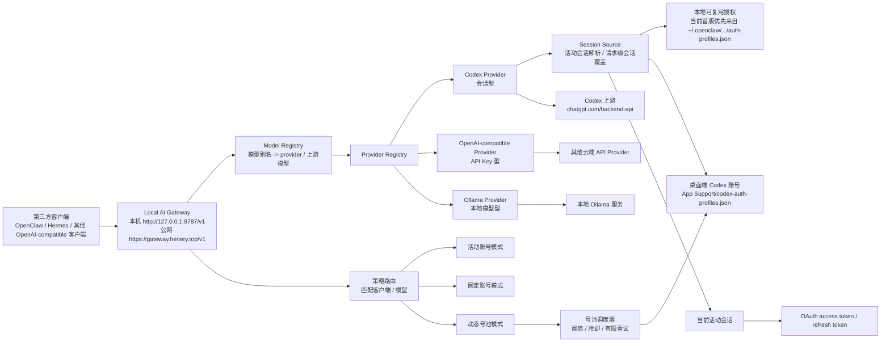

# 概念地图

本文档用于解释 `Local AI Gateway` 中最容易混淆的核心概念，并作为后续文档统一术语的基准页。

## 1. 一张图看全局



## 2. 核心术语

### 2.1 Provider

`Provider` 是网关里的“上游适配器”。

当前支持三类：

- `Codex Provider`：通过 OAuth 会话调用 Codex 上游
- `OpenAI-compatible Provider`：通过 `baseUrl + apiKey` 调用兼容接口
- `Ollama Provider`：通过本地地址调用 Ollama

### 2.2 模型别名

模型别名是第三方客户端实际填写的模型名，例如：

- `codex-default`
- `openai-compatible-default`
- `ollama-default`

它不是上游真实模型名，而是网关对外暴露的稳定名字。

### 2.3 上游模型名

上游模型名是 provider 真正调用时使用的模型标识，例如：

- `gpt-5.4`
- `gpt-4.1-mini`
- `qwen2.5-coder:7b`

它必须是上游真实支持的名字，不能随便填写。

### 2.4 桌面端 Codex 账号

这是本应用自己管理的 Codex OAuth 凭据。

来源包括：

- 桌面端 OAuth 导入
- 桌面端 JSON 导入
- 从已发现的本地可复用授权一键导入

只有这类对象，才应在产品语义上称为“本应用内的 Codex 账号”。

### 2.5 本地可复用授权

这是从本机扫描到的可复用 OAuth 凭据。当前首版主要来自 `~/.openclaw/agents/*/agent/auth-profiles.json`。

它的本质是：

- 已登录的本地授权来源
- 可被网关直接复用
- 也可导入为桌面端 Codex 账号

它不是“本应用自己的账号条目”。

### 2.6 活动会话

活动会话是当前 `Codex Provider` 实际使用的那一条 OAuth 凭据。

当前实现是：

- 可管理多个会话
- 任一时刻只使用一个活动会话
- 切换活动会话相当于手动切换当前 Codex provider 的额度来源

### 2.7 动态号池

动态号池是三期引入的“请求级自动切号”能力。

它的本质不是修改全局活动会话，而是：

- 先由策略路由判断请求是否命中某个号池
- 再由号池调度器在多个桌面端账号中动态挑选一个当前最合适的账号
- 选择依据可包括额度阈值、冷却状态、最近使用情况和有限重试结果

当前边界：

- 第一版只纳入桌面端导入账号
- 不直接把原始本地可复用授权当作正式池成员
- 不做流式输出中途热切换

### 2.8 网关 Base URL

这是第三方客户端接入本地网关时填写的入口地址。

默认值：

```txt
http://127.0.0.1:8787/v1
```

三期邀请制公网 MVP 当前入口：

```txt
https://gateway.henery.top/v1
```

含义：

- `127.0.0.1`：只允许本机访问
- `8787`：网关监听端口
- `/v1`：对外提供 OpenAI-compatible 接口前缀
- `https://gateway.henery.top/v1`：经 Cloudflare Tunnel 进入本机网关的公网成员入口，仅用于 `/v1/*` 推理面

## 3. 当前能力边界

- 当前已支持多个 Codex 会话/账号的管理
- 当前默认链路仍以“单活动会话”作为基础，但已支持通过策略路由命中固定账号或动态号池
- 当前已支持请求级动态号池调度、首字节前失败切号，以及号池运行时观测；未命中号池的请求继续沿用单活动会话 / 固定账号链路
- 当前已支持第三方客户端通过 `baseUrl + model alias` 接入
- 当前三期已支持邀请制公网成员通过 `https://gateway.henery.top/v1 + 公网成员 API Key` 接入；公网链路只开放 `/v1/*`，不开放 `/admin/*`、`/healthz` 或桌面管理面
- 当前主接入对象优先是 `OpenClaw / Hermes`，`localRagHub` 保留为次要兼容对象
- 当前推理接口默认不要求第三方额外提供 `apiKey`，但已支持可选的网关 API Key 鉴权
- 当前额度、重置时间、来源分布与 Token 用量观测都可在桌面端持续刷新；历史回补仅来自本项目本地旧请求事件，不包含外部项目统计数据

## 4. 文档维护要求

当以下内容发生变化时，应同步更新本页：

- 账号、授权、活动会话的语义调整
- Provider 类型变化
- 模型别名与上游模型的映射策略变化
- 第三方客户端接入方式变化
